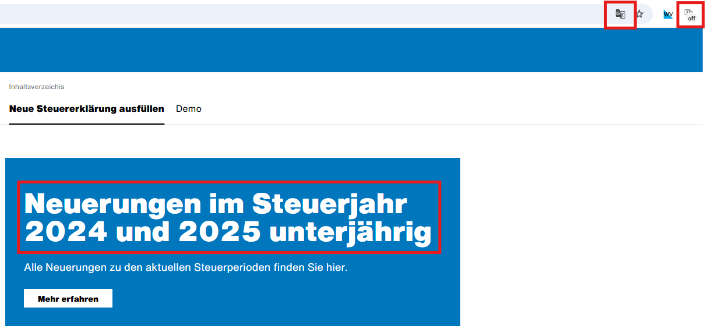
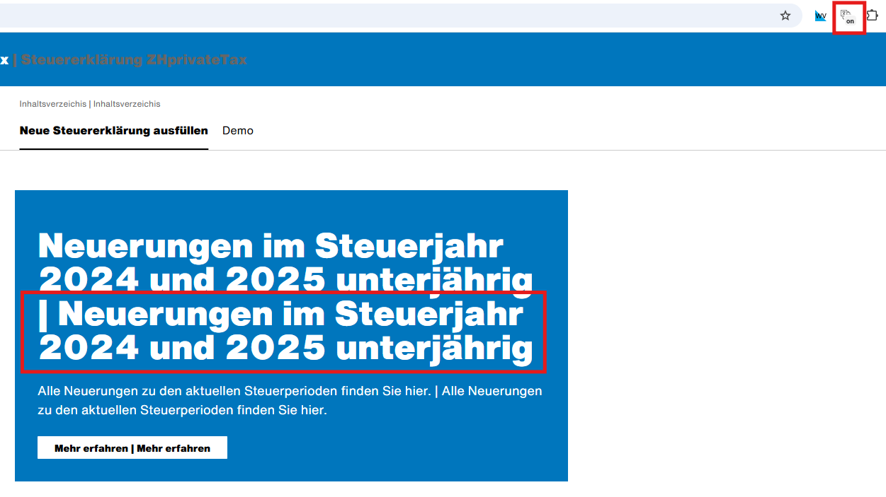
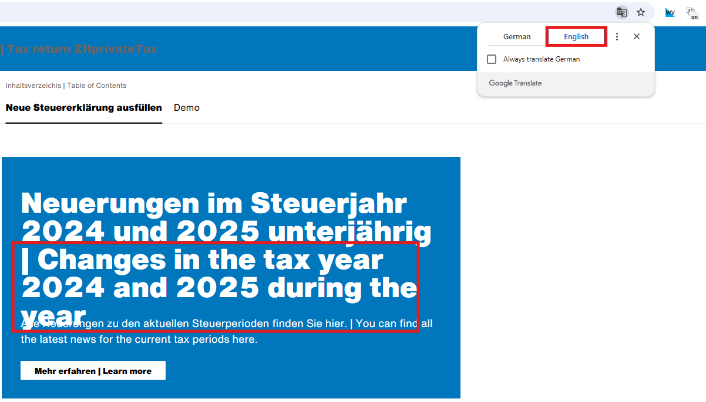

# Inline translations for ZHprivateTax2023

This Chrome extension modifies the page content of https://zhp.services.zh.ch/app/ZHprivateTax2023
to show both the original German text, and a user-chosen second language, translated via Chrome-builtin Google Translate.

No guarantees are given for translations, nor is it guaranteed that the tool continues to work as intended. It is intended as educational only.

## Installation

1. Clone this repository
2. Go to Extensions > "Manage extensions"
3. Click "Load unpacked"
4. Select the folder containing the repository

## Notes

The website must be untranslated *before* activating the inline translation.
Keep it in German, then toggle the inline translation to on, then activate translation.

Step 0: make sure the website is in German before toggling the inline translation state.

Step 1: prepare the inline translation by clicking the extension icon.

Step 2: Use the built-in translate feature to translate into the target language

# Attribution

Icon source attribution: [Translation icons created by Freepik - Flaticon](https://www.flaticon.com/free-icons/translation)
